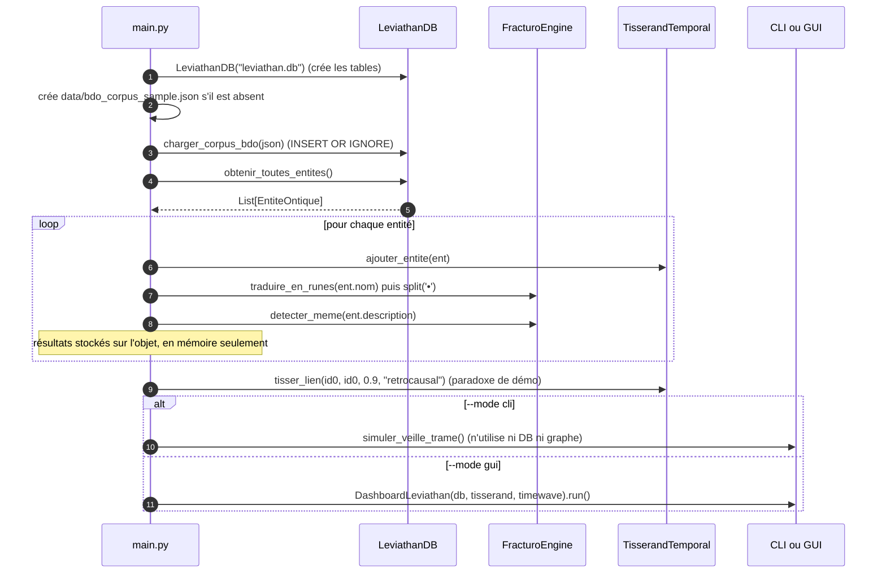

# 🌀 CHRONOS-TRAME : Le Léviathan Ontique

> *"Le temps n'est pas une ligne, c'est une toile d'araignée dont nous sommes à la fois la mouche et l'architecte."* — Codex MTT-2075

Une chimère logicielle fusionnant la détection de signaux faibles, la taxonomie des anomalies, la topologie des paradoxes temporels et la courbe de nouveauté fractale.

Ce document est à la fois **la référence technique** du dépôt (architecture, modèle de données, API de chaque module) et **un tutoriel pas à pas** (installer, lancer, étendre). Tous les extraits de code et toutes les sorties affichées ont été **exécutés et vérifiés** sur Python 3.12.

---

## Table des matières

1. [Nature du projet et état d'implémentation](#1-nature-du-projet-et-état-dimplémentation)
2. [Prérequis et installation](#2-prérequis-et-installation)
3. [Démarrage rapide](#3-démarrage-rapide)
4. [Arborescence du dépôt](#4-arborescence-du-dépôt)
5. [Architecture et flux de données](#5-architecture-et-flux-de-données)
6. [Glossaire du domaine](#6-glossaire-du-domaine)
7. [Modèle de données](#7-modèle-de-données)
8. [Référence des modules](#8-référence-des-modules)
9. [Tutoriels pas à pas](#9-tutoriels-pas-à-pas)
10. [Limites connues et pièges](#10-limites-connues-et-pièges)
11. [Dépannage](#11-dépannage)
12. [Vérifier l'installation (smoke test)](#12-vérifier-linstallation-smoke-test)
13. [Pistes d'évolution](#13-pistes-dévolution)

---

## 1. Nature du projet et état d'implémentation

Chronos-Trame est un projet **expérimental et créatif** (~430 lignes de Python) : il emprunte son vocabulaire à la fiction spéculative et à la théorie du *Timewave Zero* (Terence McKenna), et l'implémente sous forme de **modèle stylisé**. La table de nouveauté est une approximation simplifiée (voir §8.4) : elle produit un signal reproductible, pas une prédiction.

### Les 4 piliers

| # | Pilier | Rôle | Module |
|---|--------|------|--------|
| 1 | **Trame** | Détection de signaux, traduction en *FracturoScript* (runes) et repérage de *mèmes* | `core/fracturo_engine.py` |
| 2 | **BDO** | Classification ontique (Cœurs Noir/Gris/Blanc, Delta) | `core/ontology.py`, `storage/leviathan_db.py` |
| 3 | **TemporalNetwork** | Détection des cycles rétrocausaux (paradoxes) | `core/temporal_graph.py` |
| 4 | **TimeWave Zero** | Courbe de nouveauté et superposition des événements | `core/timewave.py` |

### Le « Mugissement Quantique » (concept)

Si un signal faible (Trame) de cœur Noir crée un cycle dans le graphe (Paradoxe) lors d'un pic de nouveauté (TimeWave), le système émet une alerte visuelle et narrative critique.

### ⚠️ Ce qui est réellement câblé aujourd'hui

C'est le point le plus important à connaître avant de plonger dans le code : **les briques existent, mais leur assemblage final est encore une démo**.

| Fonctionnalité | État | Détail |
|---|---|---|
| Chargement du corpus JSON → SQLite | ✅ Fonctionnel | Idempotent (`INSERT OR IGNORE`) |
| Traduction en runes / détection de mèmes | ✅ Fonctionnel | Calculé dans `main.py`, **non persisté** |
| Détection de cycles (paradoxes) | ✅ Fonctionnel | Basée sur `nx.simple_cycles` |
| Courbe de nouveauté TimeWave | ✅ Fonctionnel | Modèle simplifié |
| Dashboard GUI (graphe + courbe) | ✅ Fonctionnel | Nécessite `tkinter` et un écran |
| Mode CLI « Oracle » | 🟡 Démo | 3 signaux **codés en dur**, indépendants de la DB et du graphe |
| Alerte Mugissement (condition noir + cycle + pic) | 🟡 Non câblée | La fonction d'affichage existe ; la condition combinée est à écrire (→ [Tuto 4](#tuto-4--implémenter-le-vrai-mugissement-quantique)) |
| `config.json` | 🔴 Jamais lu | Chemins codés en dur dans `main.py` (→ [Tuto 7](#tuto-7--brancher-configjson)) |
| Flux RSS (`feedparser`) | 🔴 Non implémenté | Dépendance listée mais jamais importée |
| Guérison quantique, prophéties, pic de nouveauté | 🟡 Disponibles, jamais appelées | Méthodes prêtes à l'emploi (→ Tutos 3 et 4) |

---

## 2. Prérequis et installation

### Prérequis

- **Python 3.8+** (testé avec 3.12.3 ; `dataclasses` et les f-strings imposent au minimum 3.7).
- **tkinter** pour le mode GUI. C'est un module de la bibliothèque standard, mais il est souvent packagé à part sous Linux.
- Un terminal **UTF-8** (les runes, les emojis et les tableaux `rich` utilisent Unicode).

### Installation pas à pas

```bash
# 1. Récupérer le dépôt (ou décompresser l'archive)
unzip Chronos-Trame-main.zip && cd Chronos-Trame-main

# 2. Créer un environnement virtuel (recommandé)
python3 -m venv .venv
source .venv/bin/activate          # Windows PowerShell : .venv\Scripts\Activate.ps1

# 3. Installer les dépendances
pip install -r requirements.txt
```

> **Note.** `requirements.txt` liste `feedparser`, mais le code ne l'importe nulle part pour l'instant. Le `pip install rich networkx matplotlib numpy` de l'ancien README suffit pour tout exécuter ; installer `feedparser` est inoffensif et prépare l'évolution RSS (§13).

| Paquet | Usage réel dans le code |
|---|---|
| `rich` | Tableaux et panneaux du mode CLI (`ui/cli_oracle.py`) |
| `networkx` | Graphe orienté et détection de cycles (`core/temporal_graph.py`), dessin dans le GUI |
| `matplotlib` | Graphiques du dashboard (backend `TkAgg`) |
| `numpy` | Sinusoïde et percentile de la courbe TimeWave |
| `feedparser` | ❌ Non utilisé |

Aucune version n'est épinglée : pour un environnement reproductible, faites un `pip freeze > requirements.lock` après installation.

### Installer tkinter (GUI uniquement)

| Système | Commande |
|---|---|
| Debian / Ubuntu | `sudo apt install python3-tk` |
| Fedora | `sudo dnf install python3-tkinter` |
| macOS (Homebrew) | `brew install python-tk` |
| Windows | Inclus avec l'installeur python.org (case « tcl/tk and IDLE ») |

Vérification :

```bash
python3 -c "import tkinter; print('tkinter OK')"
```

---

## 3. Démarrage rapide

**Toujours lancer depuis la racine du dépôt** : tous les chemins (`leviathan.db`, `data/…`) sont relatifs au répertoire courant (§10).

```bash
python main.py --mode cli    # Terminal de l'Oracle (aucun écran requis)
python main.py --mode gui    # Tableau de bord visuel (défaut si --mode omis)
```

### Ce que vous verrez en mode CLI

```text
🌀 Éveil du Léviathan Ontique...
🌀 Initialisation du Métier à Tisser Quantique...
Écoute des flux RSS et calcul des résonances TimeWave...

┏━━━━━━━━━━━┳━━━━━━━━━━━━━━━━━━━━━━━━━━━━━━━━━━┳━━━━━━┳━━━━━━━┓
┃ Timestamp ┃ Signal                           ┃ Cœur ┃ Runes ┃
┡━━━━━━━━━━━╇━━━━━━━━━━━━━━━━━━━━━━━━━━━━━━━━━━╇━━━━━━╇━━━━━━━┩
│ 13:23:53  │ Anomalie magnétique en Normandie │ GRIS │ ᛏ ᚱ ᛞ │
└───────────┴──────────────────────────────────┴──────┴───────┘
... tissage du fil narratif ...

  (…le 2e signal, de cœur NOIR, déclenche le panneau ci-dessous…)

╭────────────────────────────────────────────────────────────────────────╮
│ ⚠️ MUGISSEMENT QUANTIQUE DÉTECTÉ AUX FRONTIÈRES DE L'INTRICATION ⚠️    │
│                                                                        │
│ Entité déclencheuse : Effacement mémoriel collectif signalé à Montréal │
│ FracturoScript résonant : ᚦᚦ ᛟ •••                                     │
│ Boucle rétrocausale fermée : 2026_Event -> 1944_Volknar -> 2026_Event  │
│                                                                        │
│ Le Delta s'effondre. Le passé a été réécrit. Le Léviathan s'éveille.   │
╰────────────────────────────────────────────────────────────────────────╯
```

### Ce que vous verrez en mode GUI

Une fenêtre 1200×800 à thème sombre avec **deux onglets** :

1. **🕸️ Graphe des Âges (Paradoxes)** : le graphe orienté des entités. Nœud rouge = cœur *noir*, blanc = *blanc*, gris = tout le reste. Les arêtes appartenant à un cycle sont surlignées en cyan.
2. **🌊 Onde de Nouveauté (TimeWave Zero)** : la courbe de nouveauté de 1950 à ~2032, avec un point par entité du corpus (rouge = noir, blanc = autre).

Avec le corpus d'exemple, le graphe montre un unique nœud `demo_001` avec une **boucle sur lui-même** : c'est le paradoxe artificiel créé par `main.py` (§8.7).

### Premier lancement : ce qui se passe sur le disque

Au premier lancement, `main.py` crée `leviathan.db` (SQLite, ~16 Ko) **dans le répertoire courant**, y insère le corpus, puis le réutilise aux lancements suivants. Pensez à l'ajouter à votre `.gitignore` :

```bash
echo "leviathan.db" >> .gitignore
```

---

## 4. Arborescence du dépôt

```text
Chronos-Trame-main/
├── main.py                    # 58 l. Point d'entrée : args CLI, câblage des moteurs, lancement UI
├── requirements.txt           # Dépendances (non épinglées)
├── README.md
├── core/                      # Logique métier pure (aucune E/S)
│   ├── __init__.py            #   (vide)
│   ├── ontology.py            # 36 l. Dataclass EntiteOntique : le modèle central
│   ├── fracturo_engine.py     # 45 l. Runes, mèmes, génération de prophéties
│   ├── temporal_graph.py      # 32 l. Graphe orienté, détection de paradoxes, "guérison"
│   └── timewave.py            # 36 l. Courbe de nouveauté (TimeWave simplifié)
├── storage/
│   ├── __init__.py            #   (vide)
│   └── leviathan_db.py        # 62 l. Persistance SQLite + import du corpus JSON
├── ui/
│   ├── __init__.py            #   (vide)
│   ├── cli_oracle.py          # 52 l. Interface terminal (rich) : mode démo
│   └── gui_dashboard.py       # 106 l. Dashboard tkinter + matplotlib
└── data/
    ├── bdo_corpus_sample.json # 1 entité d'exemple (format du corpus BDO)
    └── config.json            # Chemins et date zéro (⚠️ non lu par le code)
```

**Convention de nommage observée :** identifiants, docstrings et commentaires en **français** ; noms de méthodes en `snake_case` (y compris avec accent : `appliquer_guérison_quantique`, valide en Python 3).

---

## 5. Architecture et flux de données

### Dépendances entre modules

```mermaid
flowchart TD
    main["main.py<br/>(orchestrateur)"]

    subgraph core["core/ — logique pure"]
        onto["ontology.py<br/>EntiteOntique"]
        fract["fracturo_engine.py<br/>FracturoEngine"]
        graph["temporal_graph.py<br/>TisserandTemporal"]
        tw["timewave.py<br/>TimeWaveZero"]
    end

    subgraph storage["storage/"]
        db["leviathan_db.py<br/>LeviathanDB"]
    end

    subgraph ui["ui/"]
        cli["cli_oracle.py<br/>simuler_veille_trame"]
        gui["gui_dashboard.py<br/>DashboardLeviathan"]
    end

    corpus[("bdo_corpus_sample.json")]
    sqlite[("leviathan.db")]

    main --> db
    main --> fract
    main --> graph
    main --> tw
    main --> cli
    main --> gui

    fract --> onto
    graph --> onto
    db --> onto

    corpus -->|"charger_corpus_bdo()"| db
    db <--> sqlite

    gui -.->|"duck typing :<br/>db, graph, tw"| db
    gui -.-> graph
    gui -.-> tw
```

`ontology.py` est le **socle** : `fracturo_engine`, `temporal_graph` et `leviathan_db` importent tous `EntiteOntique`. L'interface GUI ne fait aucun import depuis `core`/`storage` : elle reçoit ses trois moteurs en paramètres (injection de dépendances).

### Séquence exécutée par `main.py`



---

## 6. Glossaire du domaine

Les termes ci-dessous sont **déduits du code et de l'ancien README** ; ceux qui ne sont pas exploités par le code sont signalés.

| Terme | Signification dans le code |
|---|---|
| **Trame** | Le tissu narratif/temporel global ; aussi le nom du pilier de détection de signaux. |
| **BDO** | Base de données d'anomalies (« ontiques ») dont provient le corpus JSON. Le sigle n'est pas développé dans le dépôt. |
| **Entité ontique** | Un événement/anomalie du corpus, représenté par `EntiteOntique`. |
| **Classe principale** | Catégorie de taxonomie : `RM`, `IR`, `ESC`, `VMO`, `Omega`… (liste donnée en commentaire, non validée). `NC` = non classé. |
| **Cœur dominant** | Polarité de l'entité : `"noir"`, `"gris"`, `"blanc"` ou `"NC"`. Pilote les couleurs des UI et la « guérison ». |
| **Delta** | Amplitude d'une anomalie, en `[0, 1]` dans l'exemple. Trois phases : `avant`, `pendant`, `apres`. (Le « Delta C/R/H » du README n'est pas implémenté.) |
| **Risque** | Entier de 1 à 5. |
| **Couches OSI** | `couches_osi: List[int]`. Probablement les couches du modèle OSI ; **champ jamais renseigné ni lu**. |
| **FracturoScript** | Transcription d'un texte en runes (Futhark) : `traduire_en_runes`. |
| **Paléo-mème** | Mot déclencheur (`oublie`, `boucle`, `effondrement`, `lumière`, `ombre`, `machine`) associé à une séquence de runes. |
| **Paradoxe** | Un **cycle** dans le graphe orienté (y compris une auto-boucle). |
| **Lien causal / rétrocausal** | Arête passé→futur / futur→passé (attribut `type` de l'arête). Seul le *cycle* compte pour la détection ; le type n'est pas interprété. |
| **Guérison quantique** | Réduction du Delta et passage du cœur à `noir` pour les entités d'un cycle. |
| **Nouveauté** | Valeur de la courbe TimeWave à une date donnée. |
| **Pic de nouveauté** | Valeur dans le top 10 % (≥ percentile 90) d'un historique fourni. |
| **Mugissement Quantique** | Alerte critique (panneau rouge) : cœur noir + cycle + pic de nouveauté. |
| **Léviathan / Tisserand** | Noms de fantaisie : `LeviathanDB` (base), `TisserandTemporal` (graphe), `DashboardLeviathan` (GUI). |

---

## 7. Modèle de données

### 7.1 `EntiteOntique` (`core/ontology.py`)

Dataclass (mutable) représentant une entité. Les 11 premiers champs sont **obligatoires** ; les suivants ont une valeur par défaut.

| Champ | Type | Défaut | Rôle |
|---|---|---|---|
| `id` | `str` | requis | Identifiant unique (clé du nœud dans le graphe et clé primaire SQL) |
| `nom` | `str` | requis | Libellé affiché |
| `description` | `str` | requis | Texte analysé pour les mèmes |
| `date_debut` | `str` | requis | Date ISO `YYYY-MM-DD` |
| `date_fin` | `Optional[str]` | requis | Date de fin (toujours `None` après lecture DB) |
| `classe_principale` | `str` | requis | `RM`, `IR`, `ESC`, `VMO`, `Omega`, `NC`… |
| `coeur_dominant` | `str` | requis | `noir` / `gris` / `blanc` / `NC` |
| `delta_avant` | `float` | requis | Delta avant l'événement |
| `delta_pendant` | `float` | requis | Delta pendant (celui que modifie la « guérison ») |
| `delta_apres` | `float` | requis | Delta après |
| `risque` | `int` | requis | 1 à 5 |
| `couches_osi` | `List[int]` | `[]` | Non exploité |
| `fragments_runiques` | `List[str]` | `[]` | Renseigné par `main.py` |
| `paleo_memes` | `List[str]` | `[]` | Renseigné par `main.py` |
| `superposition_active` | `bool` | `False` | Non exploité |
| `intention_observateur` | `float` | `0.5` | `0.0` (Noir) → `1.0` (Blanc) ; non exploité |

Membres utiles :

- `delta_moyen` (propriété) : moyenne arithmétique des trois deltas.
- `to_dict()` : renvoie `{k: v for k, v in self.__dict__.items()}` (copie superficielle des attributs).

### 7.2 Format du corpus JSON (`data/bdo_corpus_sample.json`)

Le fichier est une **liste** d'objets :

```json
[
  {
    "id": "demo_001",
    "nom": "Synchronicité de Vauville",
    "description": "Alignement runique spontané",
    "date_debut": "1999-12-31",
    "taxonomie": {"classe_principale": "ESC"},
    "coeur_dominant": "gris",
    "delta_estime": {"pendant": 0.4},
    "risque": 2
  }
]
```

### 7.3 Correspondance JSON → SQLite → objet

Tous les champs sont **facultatifs** dans le JSON : `charger_corpus_bdo` applique des valeurs par défaut.

| Clé JSON | Colonne SQL | Défaut si absent | Champ `EntiteOntique` |
|---|---|---|---|
| `id` | `id` (PK) | `"unknown"` | `id` |
| `nom` | `nom` | `"Inconnu"` | `nom` |
| `description` | `description` | `""` — **tronquée à 100 caractères** | `description` |
| `date_debut` | `date_debut` | `"1970-01-01"` | `date_debut` |
| `taxonomie.classe_principale` | `classe` | `"NC"` | `classe_principale` |
| `coeur_dominant` | `coeur` | `"gris"` | `coeur_dominant` |
| `delta_estime.pendant` | `delta_pendant` | `0.5` | `delta_avant` **=** `delta_pendant` **=** `delta_apres` |
| `risque` | `risque` | `1` | `risque` |
| *(aucune)* | `runes` | `""` | `fragments_runiques` |
| *(aucune)* | `couches` | `""` | `couches_osi` |

> **Perte d'information à l'import.** `delta_estime.avant` et `delta_estime.apres` du JSON sont ignorés ; `date_fin` n'existe pas en base. Deux entrées sans `id` entrent en collision sur `"unknown"` (la seconde est ignorée).

### 7.4 Schéma SQLite (`leviathan.db`)

```sql
CREATE TABLE entites (
    id TEXT PRIMARY KEY, nom TEXT, description TEXT, date_debut TEXT,
    classe TEXT, coeur TEXT, delta_pendant REAL, risque INTEGER,
    runes TEXT, couches TEXT
);

CREATE TABLE liens_temporels (
    source TEXT, cible TEXT, force REAL, type TEXT   -- ⚠️ jamais lue ni écrite par le code
);
```

Pour inspecter la base :

```bash
sqlite3 leviathan.db "SELECT id, nom, coeur, delta_pendant FROM entites;"
# ou, sans le binaire sqlite3 :
python3 -c "import sqlite3; print(sqlite3.connect('leviathan.db').execute('SELECT * FROM entites').fetchall())"
```

### 7.5 `data/config.json`

```json
{
  "db_path": "leviathan.db",
  "corpus_path": "data/bdo_corpus_sample.json",
  "timewave_zero_date": "2012-12-21"
}
```

⚠️ **Ce fichier n'est lu par aucun module.** Les mêmes valeurs sont codées en dur dans `main.py` et `TimeWaveZero.__init__`. Le [Tuto 7](#tuto-7--brancher-configjson) montre comment le brancher.

---

## 8. Référence des modules

### 8.1 `core/ontology.py`

Voir §7.1. Aucune logique, aucune dépendance externe.

### 8.2 `core/fracturo_engine.py` : le moteur de runes

**Constantes globales**

- `RUNE_ALPHABET` : dictionnaire lettre minuscule → rune. Couvre `a b c d e f g h i j k l m n o p r s t u w z` et l'espace (→ `•`).
  - `c` et `k` donnent la **même rune** `ᚲ` (transcription non réversible).
  - **Absentes** : `q`, `v`, `x`, `y`, ainsi que tous les caractères accentués et la ponctuation.
- `MEMETIC_TRIGGERS` : 6 mots déclencheurs.

| Mot déclencheur | Séquence runique |
|---|---|
| `oublie` | `ᛖᛈᛋᛁᛚᛟᚾ` |
| `boucle` | `ᛟᚱᛟᛒᛟᚱᛟ` |
| `effondrement` | `ᚦᚦᚦ` |
| `lumière` | `ᛋᛟᚹᛁᛚᛟ` |
| `ombre` | `ᚾᛁᚺᛏ` |
| `machine` | `ᛗᛖᚲᚨᚾᛖ` |

**Classe `FracturoEngine`**

| Méthode | Signature | Comportement |
|---|---|---|
| `__init__` | `()` | `self.lexique = RUNE_ALPHABET` (**même objet**, pas une copie : modifier `lexique` modifie la constante globale) |
| `traduire_en_runes` | `(texte: str) -> str` | Ne traite que les **30 premiers caractères**. Chaque lettre est passée en minuscule puis cherchée dans le lexique ; si absente, le caractère **d'origine** est conservé tel quel. |
| `detecter_meme` | `(texte: str) -> List[str]` | Pour chaque déclencheur présent **comme sous-chaîne** dans `texte.lower()`, ajoute `"DÉCLENCHEUR(runes)"` en majuscules. |
| `generer_prophetie` | `(entite, paradoxe: bool) -> str` | Renvoie un texte (variante `[ROUGE]` si `paradoxe`, `[CYAN]` sinon). Utilise `entite.fragments_runiques` (sinon traduit le nom) et `entite.paleo_memes`. |

Exemples vérifiés :

```python
>>> f = FracturoEngine()
>>> f.traduire_en_runes("Synchronicité de Vauville")
'ᛋyᚾᚲᚺᚱᛟᚾᛁᚲᛁᛏé•ᛞᛖ•Vᚨᚢvᛁᛚᛚᛖ'          # y, é, V, v non traduits
>>> f.detecter_meme("La boucle de l'oubli dans l'ombre de la machine, "
...                 "effondrement de la lumière")
['BOUCLE(ᛟᚱᛟᛒᛟᚱᛟ)', 'EFFONDREMENT(ᚦᚦᚦ)', 'LUMIÈRE(ᛋᛟᚹᛁᛚᛟ)', 'OMBRE(ᚾᛁᚺᛏ)', 'MACHINE(ᛗᛖᚲᚨᚾᛖ)']
                                          # "oubli" ne déclenche pas "oublie"
```

`generer_prophetie` avec le corpus d'exemple :

```text
paradoxe=True  → ⚠️ [ROUGE] LE TISSEUR SAIGNE : La boucle est fermée. Synchronicité de Vauville
                 n'est pas un événement, mais la cicatrice d'une rétrocausalité GRIS. Le
                 FracturoScript résonne : ᛋyᚾᚲᚺᚱᛟᚾᛁᚲᛁᛏéᛞᛖVᚨᚢvᛁᛚᛚᛖ. Le Delta s'effondre vers le Néant.
paradoxe=False → 🌀 [CYAN] FIL TISSÉ : Synchronicité de Vauville s'inscrit dans la Trame.
                 Résonance GRIS. Les paléo-mèmes dormant s'éveillent : .
```

Deux détails à noter : les `•` (séparateurs de mots) disparaissent car les fragments sont recollés avec `"".join(...)`, et la liste des mèmes est vide dans l'exemple, d'où le `: .` final.

`random`, `hashlib` et `Dict` sont importés mais inutilisés.

### 8.3 `core/temporal_graph.py` : le graphe des paradoxes

`TisserandTemporal` encapsule un `networkx.DiGraph` (attribut `graphe`). Chaque nœud a pour clé `entite.id` et porte l'objet complet dans l'attribut `data`.

| Méthode | Signature | Comportement |
|---|---|---|
| `ajouter_entite` | `(entite)` | `add_node(entite.id, data=entite)` |
| `tisser_lien` | `(id_source, id_cible, force, type_lien="causal")` | `add_edge(..., weight=force, type=type_lien)`. `"retrocausal"` = futur → passé. Un id inconnu est **créé silencieusement** comme nœud vide (sans attribut `data`), ce qui casserait ensuite l'accès `graphe.nodes[id]['data']`. |
| `detecter_paradoxes` | `() -> List[List[str]]` | `list(nx.simple_cycles(graphe))`. Inclut les **auto-boucles** (cycle d'un seul nœud). |
| `appliquer_guérison_quantique` | `(cycle: List[str])` | Pour chaque nœud du cycle : `delta_pendant = max(0.05, delta_pendant * 0.5)` et `coeur_dominant = "noir"`. |

Points d'attention :

- L'**ordre des nœuds** dans un cycle renvoyé n'est pas garanti ; ne comptez pas sur `cycle[0]`.
- `nx.simple_cycles` peut être coûteux (exponentiel dans le pire cas) sur de gros graphes denses.
- La force (`weight`) et le type du lien ne sont pas pris en compte par la détection.
- `appliquer_guérison_quantique` est **destructrice et non idempotente** : chaque appel divise à nouveau le delta par deux (jusqu'au plancher de `0.05`).

### 8.4 `core/timewave.py` : la courbe de nouveauté

`TimeWaveZero(zero_date_str="2012-12-21")`

- `zero_date` : `datetime` de la « date zéro ».
- `novelty_diffs` : liste de 64 valeurs (une par hexagramme). Commentaire du code : *« Table de King Wen simplifiée »*. Elle est **schématique** (les indices 16, 32 et 48 valent `16`, presque tout le reste `-2`) : ce n'est pas le jeu de données complet de la théorie d'origine.
- `scales = [1, 64, 4096]` : trois échelles de temps en **jours** (1 j, 64 j, 4096 j ≈ 11,2 ans).

#### Algorithme de `calculer_nouveaute(target_date) -> float`

```text
jours = (date_zero - target_date).days              # positif avant la date zéro, négatif après
pour chaque échelle s dans [1, 64, 4096]:
    indice = abs(jours // s) % 64
    nouveauté += novelty_diffs[indice]
nouveauté += 2 × sin( (jours / 67.29) × 2π )         # lissage sinusoïdal
```

**Exemple chiffré : 31 décembre 1999**

| Étape | Calcul | Valeur |
|---|---|---|
| `jours` | 2012-12-21 − 1999-12-31 | `4739` |
| Échelle 1 | `abs(4739 // 1) % 64 = 3` → `novelty_diffs[3]` | `-6` |
| Échelle 64 | `abs(4739 // 64) % 64 = 10` → `novelty_diffs[10]` | `-2` |
| Échelle 4096 | `abs(4739 // 4096) % 64 = 1` → `novelty_diffs[1]` | `-3` |
| Sinusoïde | `2·sin(4739/67.29 · 2π)` | `+0.891` |
| **Total** | | **`-10.109`** |

Valeurs de repère : nouveauté à la date zéro = `0.0` ; au 29/09/2026 = `-3.0`. Sur l'échantillon 1950 → ~2032 (pas de 60 jours, 500 points) : minimum ≈ `-15.99`, maximum ≈ `33.89`, percentile 90 ≈ `13.17`.

> **Asymétrie.** À cause de `abs(jours // s)` (division entière arrondie vers −∞), la courbe **n'est pas symétrique** de part et d'autre de la date zéro. Un jour avant et un jour après ne donnent pas les mêmes indices.

#### `est_pic_de_nouveaute(target_date, historique_nouveaute: list) -> bool`

Renvoie `True` si la nouveauté de `target_date` est **≥ au percentile 90** de `historique_nouveaute` (que **vous** devez fournir) ; `False` si l'historique est vide. Cette méthode n'est appelée nulle part dans le dépôt.

### 8.5 `storage/leviathan_db.py` : la persistance

`LeviathanDB(db_path="leviathan.db")` : chaque méthode ouvre/ferme sa propre connexion `sqlite3` (pas de connexion persistante, donc pas de problème de thread).

| Méthode | Comportement |
|---|---|
| `__init__` | Crée le fichier et les deux tables (`CREATE TABLE IF NOT EXISTS`). |
| `charger_corpus_bdo(json_path)` | Retourne silencieusement si le fichier n'existe pas. Sinon `INSERT OR IGNORE` de chaque entrée (voir §7.3). |
| `obtenir_toutes_entites()` | `SELECT *` → liste d'`EntiteOntique`. Reconstruit `fragments_runiques` (split sur `,`) et `couches_osi` (split sur `,` puis `int`) si les colonnes sont non vides. |

> **`INSERT OR IGNORE` = jamais de mise à jour.** Modifier une entrée existante dans le JSON (même `id`) n'a **aucun effet** sur une base déjà remplie (vérifié : un `coeur_dominant` passé de `gris` à `noir` reste `gris`). Supprimez `leviathan.db` pour repartir du JSON.

### 8.6 `ui/cli_oracle.py` : l'Oracle en terminal

- `afficher_mugissement_quantique(entite_nom, runes, cycle_paradoxe)` : affiche le panneau rouge `rich` ; le cycle est rendu avec `" -> ".join(cycle_paradoxe)`. **Réutilisable** tel quel (→ Tuto 4).
- `simuler_veille_trame()` : boucle sur 3 signaux **codés en dur** `(nom, coeur, paradoxe)`. Pour chacun : tableau `rich` (timestamp, signal, cœur coloré, runes) ; si `paradoxe=True`, appel à `afficher_mugissement_quantique` avec un cycle factice `["2026_Event", "1944_Volknar", "2026_Event"]`. Les runes affichées sont, elles aussi, des chaînes fixes.

Codes couleur du cœur : `noir` → rouge, `blanc` → blanc, autre → jaune.

### 8.7 `ui/gui_dashboard.py` : le dashboard

`DashboardLeviathan(db, graph_engine, timewave_engine)` ouvre une fenêtre `tk.Tk` 1200×800 (fond `#0f0f1b`) et construit un `ttk.Notebook` de deux onglets, chacun contenant une figure matplotlib intégrée (`FigureCanvasTkAgg`).

| Méthode | Rôle |
|---|---|
| `_creer_interface()` | Construit les onglets et les figures |
| `_tracer_graphe()` | `spring_layout(seed=42, k=0.9)`. Couleurs de nœuds : noir `#ff3333`, blanc `#ffffff`, autre `#aaaaaa`. Arêtes `#4ec9b0`. Les cycles sont redessinés en cyan (largeur 3) via `zip(cycle, cycle[1:] + [cycle[0]])`. Message « Le Léviathan dort… » si le graphe est vide. |
| `_tracer_timewave()` | 500 dates de 1950-01-01, pas de 60 jours (≈ 82 ans). Trace la courbe et remplit sous la courbe. Superpose **au plus 20 entités** (rouge = noir, blanc = autre) ; une `date_debut` invalide est ignorée sans erreur. |
| `run()` | `root.mainloop()` |

**Câblage effectué par `main.py`** (il suffit de le savoir pour comprendre ce que le dashboard affiche) : toutes les entités de la DB sont ajoutées au graphe, puis un lien `tisser_lien(entites[0].id, entites[0].id, 0.9, "retrocausal")` est créé. Le premier nœud a donc toujours une auto-boucle : **le dashboard montre toujours un paradoxe**, quel que soit le corpus.

---

## 9. Tutoriels pas à pas

> **Convention :** sauf mention contraire, les scripts se placent **à la racine du dépôt** (à côté de `main.py`) pour que `import core…` fonctionne. Depuis un autre dossier, utilisez `PYTHONPATH=/chemin/vers/Chronos-Trame-main python votre_script.py`.

---

### Tuto 1 : Lancer et comprendre la démo

**Objectif :** exécuter les deux modes et lire ce qu'ils affichent.

1. Depuis la racine : `python main.py --mode cli`. Observez les trois signaux et le panneau rouge du deuxième.
2. Constatez la création de `leviathan.db` : `ls -la leviathan.db`.
3. Lancez `python main.py --mode gui` : ouvrez l'onglet **Graphe** (un nœud + une boucle = le paradoxe de démo) puis l'onglet **Onde de Nouveauté** (un point blanc vers l'an 2000 pour `demo_001`).
4. Relisez `main.py` avec le diagramme de séquence du §5 sous les yeux.

**À retenir :** en mode CLI, tout le travail de peuplement de la DB et du graphe est effectué **puis ignoré** ; seule la fonction de démo est appelée.

---

### Tuto 2 : Ajouter une entité au corpus

**Objectif :** injecter votre propre anomalie et la voir apparaître dans le GUI.

**1. Éditez `data/bdo_corpus_sample.json`** : ajoutez un objet à la liste (n'oubliez pas la virgule entre les objets) :

```json
{
  "id": "evt_001",
  "nom": "Effacement mémoriel de Montréal",
  "description": "Une boucle d'oubli collectif, l'ombre d'une machine",
  "date_debut": "2010-03-01",
  "taxonomie": {"classe_principale": "IR"},
  "coeur_dominant": "noir",
  "delta_estime": {"pendant": 0.7},
  "risque": 4
}
```

**2. Rechargez la base.** Le nouvel `id` sera inséré même si `leviathan.db` existe déjà (seuls les `id` déjà présents sont ignorés). Si vous modifiez une entrée **existante**, supprimez d'abord la base : `rm leviathan.db`.

**3. Vérifiez** :

```python
from storage.leviathan_db import LeviathanDB
from core.fracturo_engine import FracturoEngine

db = LeviathanDB("leviathan.db")
db.charger_corpus_bdo("data/bdo_corpus_sample.json")
f = FracturoEngine()
for e in db.obtenir_toutes_entites():
    print(e.id, "|", e.nom, "|", e.coeur_dominant, "|", e.delta_pendant, "|", f.detecter_meme(e.description))
```

Sortie :

```text
demo_001 | Synchronicité de Vauville | gris | 0.4 | []
evt_001 | Effacement mémoriel de Montréal | noir | 0.7 | ['BOUCLE(ᛟᚱᛟᛒᛟᚱᛟ)', 'OMBRE(ᚾᛁᚺᛏ)', 'MACHINE(ᛗᛖᚲᚨᚾᛖ)']
```

Notez que `"oubli"` (dans « d'oubli ») **ne** déclenche **pas** le mème `oublie` : le déclencheur est une sous-chaîne exacte (§8.2).

**4. `python main.py --mode gui`** : un second nœud (rouge, car cœur noir) apparaît dans le graphe, et un point rouge sur la courbe à mars 2010.

---

### Tuto 3 : Créer un vrai paradoxe (et le « guérir »)

**Objectif :** produire un cycle authentique entre deux événements, sans l'auto-boucle de démo.

Créez `tuto_paradoxe.py` à la racine :

```python
from core.ontology import EntiteOntique
from core.temporal_graph import TisserandTemporal

def evt(id_, nom, date, coeur, delta):
    return EntiteOntique(id=id_, nom=nom, description="", date_debut=date, date_fin=None,
                         classe_principale="RM", coeur_dominant=coeur,
                         delta_avant=delta, delta_pendant=delta, delta_apres=delta, risque=3)

tis = TisserandTemporal()
a = evt("evt_1944", "Volknar",    "1944-06-06", "gris",  0.6)
b = evt("evt_2026", "Effacement", "2026-09-29", "blanc", 0.8)
tis.ajouter_entite(a); tis.ajouter_entite(b)

tis.tisser_lien("evt_1944", "evt_2026", 0.7, "causal")
print("1) causal seul       :", tis.detecter_paradoxes())

tis.tisser_lien("evt_2026", "evt_1944", 0.9, "retrocausal")
cycles = tis.detecter_paradoxes()
print("2) + rétrocausal     :", cycles)

for c in cycles:
    tis.appliquer_guérison_quantique(c)
for e in (a, b):
    print(f"3) {e.id}: coeur={e.coeur_dominant}, delta_pendant={e.delta_pendant}")

for _ in range(6):
    tis.appliquer_guérison_quantique(["evt_2026"])
print("4) plancher 0.05     :", b.delta_pendant)
```

Sortie attendue :

```text
1) causal seul       : []
2) + rétrocausal     : [['evt_2026', 'evt_1944']]
3) evt_1944: coeur=noir, delta_pendant=0.3
3) evt_2026: coeur=noir, delta_pendant=0.4
4) plancher 0.05     : 0.05
```

**Ce qu'il faut comprendre**

- Une seule arête passé → futur ne forme **pas** de paradoxe ; c'est la fermeture du cycle par le lien rétrocausal qui en crée un.
- La guérison divise chaque delta par deux **et** passe le cœur à `noir` (le paradoxe « corrompt »), y compris pour une entité initialement `blanc`.
- Appelée plusieurs fois, elle converge vers le plancher `0.05`.
- L'ordre dans le cycle (`['evt_2026', 'evt_1944']`) peut varier selon la version de NetworkX.

---

### Tuto 4 : Implémenter le vrai Mugissement Quantique

**Objectif :** câbler la règle décrite dans le README d'origine : **cœur noir + cycle + pic de nouveauté**.

Les trois ingrédients existent déjà mais ne sont jamais réunis : `detecter_paradoxes()`, `est_pic_de_nouveaute()` et `afficher_mugissement_quantique()`. Créez `tuto_mugissement.py` :

```python
from datetime import datetime, timedelta
from core.ontology import EntiteOntique
from core.temporal_graph import TisserandTemporal
from core.timewave import TimeWaveZero
from core.fracturo_engine import FracturoEngine
from ui.cli_oracle import afficher_mugissement_quantique

def historique_nouveaute(tw, debut=datetime(1950, 1, 1), pas_jours=60, n=500):
    """Même échantillonnage que le GUI (gui_dashboard._tracer_timewave)."""
    return [tw.calculer_nouveaute(debut + timedelta(days=i * pas_jours)) for i in range(n)]

def detecter_mugissements(tisserand, tw, historique):
    """Cœur noir + cycle + pic de nouveauté => liste de (cycle, entités) critiques."""
    critiques = []
    for cycle in tisserand.detecter_paradoxes():
        entites = [tisserand.graphe.nodes[n]["data"] for n in cycle]
        a_coeur_noir = any(e.coeur_dominant == "noir" for e in entites)
        a_pic = any(
            tw.est_pic_de_nouveaute(datetime.strptime(e.date_debut, "%Y-%m-%d"), historique)
            for e in entites
        )
        if a_coeur_noir and a_pic:
            critiques.append((cycle, entites))
    return critiques

tw, fr, tis = TimeWaveZero(), FracturoEngine(), TisserandTemporal()

def mk(i, nom, date, coeur):
    return EntiteOntique(i, nom, "", date, None, "IR", coeur, 0.5, 0.5, 0.5, 4)

a = mk("evt_2010", "Effacement mémoriel", "2010-03-01", "noir")
b = mk("evt_1944", "Volknar",             "1944-06-06", "gris")
for e in (a, b):
    tis.ajouter_entite(e)
tis.tisser_lien("evt_1944", "evt_2010", 0.7, "causal")
tis.tisser_lien("evt_2010", "evt_1944", 0.9, "retrocausal")

hist = historique_nouveaute(tw)
for cycle, entites in detecter_mugissements(tis, tw, hist):
    declencheur = next(e for e in entites if e.coeur_dominant == "noir")
    afficher_mugissement_quantique(declencheur.nom,
                                   fr.traduire_en_runes(declencheur.nom),
                                   cycle + [cycle[0]])   # referme visuellement la boucle
```

Sortie :

```text
╭──────────────────────────────────────────────────────────────────────╮
│ ⚠️ MUGISSEMENT QUANTIQUE DÉTECTÉ AUX FRONTIÈRES DE L'INTRICATION ⚠️  │
│                                                                      │
│ Entité déclencheuse : Effacement mémoriel                            │
│ FracturoScript résonant : ᛖᚠᚠᚨᚲᛖᛗᛖᚾᛏ•ᛗéᛗᛟᚱᛁᛖᛚ                        │
│ Boucle rétrocausale fermée : evt_1944 -> evt_2010 -> evt_1944        │
│                                                                      │
│ Le Delta s'effondre. Le passé a été réécrit. Le Léviathan s'éveille. │
╰──────────────────────────────────────────────────────────────────────╯
```

**Pourquoi 2010-03-01 ?** La nouveauté de cette date vaut `17.0`, au-dessus du seuil de `13.17` (percentile 90) : c'est un pic. Remplacez-la par `2021-04-12` (nouveauté `9.95`) et le Mugissement **ne se déclenche plus**, alors que le cycle et le cœur noir sont toujours là.

**Pour aller plus loin :** appelez `tis.appliquer_guérison_quantique(cycle)` et `fr.generer_prophetie(entite, paradoxe=True)` dans la boucle pour obtenir la réponse narrative complète, puis intégrez `detecter_mugissements` à `main.py` en remplacement de `simuler_veille_trame()`.

---

### Tuto 5 : Étendre le FracturoScript

**Objectif :** couvrir les lettres manquantes, gérer les accents et ajouter un mème.

```python
import unicodedata
from core.fracturo_engine import FracturoEngine, MEMETIC_TRIGGERS

f = FracturoEngine()
print("avant :", f.traduire_en_runes("Vauville quiz yeux"))
# avant : Vᚨᚢvᛁᛚᛚᛖ•qᚢᛁᛉ•yᛖᚢx

# 1) Lettres manquantes (lexique est le dictionnaire global : la modification est partagée)
f.lexique.update({"v": "ᚹ", "y": "ᛁ", "x": "ᚲᛋ", "q": "ᚲᚹ"})
print("après :", f.traduire_en_runes("Vauville quiz yeux"))
# après : ᚹᚨᚢᚹᛁᛚᛚᛖ•ᚲᚹᚢᛁᛉ•ᛁᛖᚢᚲᛋ

# 2) Accents : normaliser avant de traduire
def sans_accents(t):
    return "".join(c for c in unicodedata.normalize("NFD", t) if unicodedata.category(c) != "Mn")

print(f.traduire_en_runes(sans_accents("Synchronicité")))
# ᛋᛁᚾᚲᚺᚱᛟᚾᛁᚲᛁᛏᛖ

# 3) Nouveau mème déclencheur
MEMETIC_TRIGGERS["miroir"] = "ᛗᛁᚱᛟᛁᚱ"
print(f.detecter_meme("Un miroir sans machine"))
# ['MACHINE(ᛗᛖᚲᚨᚾᛖ)', 'MIROIR(ᛗᛁᚱᛟᛁᚱ)']
```

**Notes**

- Les valeurs du lexique peuvent être **multi-caractères** (`x → ᚲᛋ`), puisque la traduction concatène des chaînes.
- Le Futhark ancien n'a pas de `v`, `x`, `y`, `q` : les correspondances ci-dessus sont des **choix phonétiques** (`ᚹ` = w/v, `ᚲᛋ` = k+s), à adapter à votre convention.
- Pour lever la limite de 30 caractères, modifiez `texte[:30]` dans `traduire_en_runes`.
- Pour que `"oubli"` déclenche le mème, remplacez la clé `"oublie"` par `"oubli"` (le test est une sous-chaîne, donc `"oubli"` couvre aussi `"oublie"`, `"oubliée"`…).

---

### Tuto 6 : Explorer la courbe de nouveauté

**Objectif :** trouver les dates « chaudes » d'une période.

```python
from datetime import datetime, timedelta
from core.timewave import TimeWaveZero

tw = TimeWaveZero()
jours = [datetime(2020, 1, 1) + timedelta(days=i) for i in range(365 * 7)]
for d in sorted(jours, key=tw.calculer_nouveaute, reverse=True)[:5]:
    print(d.date(), round(tw.calculer_nouveaute(d), 2))
```

Sortie :

```text
2026-12-12 32.61
2026-11-26 32.3
2021-04-02 29.74
2026-11-10 29.59
2021-05-04 27.99
```

Variantes utiles :

```python
# Changer la date zéro (autre référence temporelle)
tw2 = TimeWaveZero("2026-01-01")

# La nouveauté à la date zéro elle-même est toujours 0.0
tw.calculer_nouveaute(datetime(2012, 12, 21))   # 0.0
```

> Les pics à 16 (indices 16/32/48) se répètent avec les échelles 1, 64 et 4096 jours : c'est la structure de la table simplifiée (§8.4) qui produit ces « sursauts » réguliers, visibles sur la courbe du GUI.

---

### Tuto 7 : Brancher `config.json`

**Objectif :** que `main.py` obéisse enfin à `data/config.json`.

⚠️ **Piège découvert à l'exécution :** `main.py` contient un `import json` **à l'intérieur** de la fonction `main()` (dans le bloc de création du corpus mock). Cela fait de `json` une variable *locale* pour toute la fonction : tout usage antérieur lève `UnboundLocalError`. Il faut donc **supprimer cet import local** en plus d'ajouter l'import en tête de fichier.

Patch à appliquer à `main.py` :

```diff
 # main.py
 import argparse
+import json
 import os
 ...
     # 1. Initialisation des moteurs
-    db = LeviathanDB("leviathan.db")
+    with open("data/config.json", encoding="utf-8") as f:
+        cfg = json.load(f)
+
+    db = LeviathanDB(cfg["db_path"])
 
     # Charger le corpus BDO s'il existe (ou créer un mock pour la démo)
     if not os.path.exists("data/bdo_corpus_sample.json"):
         os.makedirs("data", exist_ok=True)
         with open("data/bdo_corpus_sample.json", "w", encoding="utf-8") as f:
-            import json
             json.dump([{
 ...
-    db.charger_corpus_bdo("data/bdo_corpus_sample.json")
+    db.charger_corpus_bdo(cfg["corpus_path"])
 ...
-    timewave = TimeWaveZero()
+    timewave = TimeWaveZero(cfg["timewave_zero_date"])
```

**Test :** mettez `"db_path": "custom_name.db"` dans `config.json`, relancez `python main.py --mode cli`, puis `ls *.db` → `custom_name.db` doit apparaître (vérifié).

Le chemin `data/config.json` reste relatif au répertoire courant : lancez toujours depuis la racine, ou passez à `pathlib.Path(__file__).parent` pour vous en affranchir.

---

### Tuto 8 : Persister les liens temporels

**Objectif :** exploiter la table `liens_temporels`, aujourd'hui vide et inutilisée, pour que le graphe survive au redémarrage.

Ajoutez ces deux méthodes à `LeviathanDB` (dans `storage/leviathan_db.py`) :

```python
    def sauver_lien(self, source, cible, force, type_lien="causal"):
        with sqlite3.connect(self.db_path) as conn:
            # La table n'a pas de clé primaire : on supprime l'éventuel doublon avant d'insérer
            conn.execute("DELETE FROM liens_temporels WHERE source=? AND cible=? AND type=?",
                         (source, cible, type_lien))
            conn.execute("INSERT INTO liens_temporels (source, cible, force, type) VALUES (?,?,?,?)",
                         (source, cible, force, type_lien))

    def obtenir_liens(self):
        with sqlite3.connect(self.db_path) as conn:
            return conn.execute("SELECT source, cible, force, type FROM liens_temporels").fetchall()
```

Utilisation :

```python
from storage.leviathan_db import LeviathanDB
from core.temporal_graph import TisserandTemporal

db = LeviathanDB("leviathan.db")
db.sauver_lien("demo_001", "evt_001", 0.6, "causal")
db.sauver_lien("evt_001", "demo_001", 0.9, "retrocausal")
db.sauver_lien("evt_001", "demo_001", 0.9, "retrocausal")   # doublon : sans effet

tis = TisserandTemporal()
for e in db.obtenir_toutes_entites():
    tis.ajouter_entite(e)                    # les nœuds d'abord (sinon nœuds sans 'data')
for s, c, force, t in db.obtenir_liens():
    tis.tisser_lien(s, c, force, t)

print(db.obtenir_liens())
# [('demo_001', 'evt_001', 0.6, 'causal'), ('evt_001', 'demo_001', 0.9, 'retrocausal')]
print(tis.detecter_paradoxes())
# [['evt_001', 'demo_001']]
```

Ensuite, dans `main.py`, remplacez la ligne de l'auto-boucle artificielle par le rechargement des liens réels : le dashboard ne montrera alors un paradoxe **que si** vos données en contiennent un.

---

### Bonus : Exporter les graphiques en PNG (sans écran)

Utile sur un serveur, en CI ou pour documenter. Nécessite `tkinter` (car le GUI l'importe) et `xvfb` sous Linux (`sudo apt install python3-tk xvfb`).

```python
# export_png.py (à la racine)
from core.temporal_graph import TisserandTemporal
from core.timewave import TimeWaveZero
from storage.leviathan_db import LeviathanDB
from ui.gui_dashboard import DashboardLeviathan

db = LeviathanDB("leviathan.db"); db.charger_corpus_bdo("data/bdo_corpus_sample.json")
tis, tw = TisserandTemporal(), TimeWaveZero()
ents = db.obtenir_toutes_entites()
for e in ents:
    tis.ajouter_entite(e)
tis.tisser_lien(ents[0].id, ents[0].id, 0.9, "retrocausal")

app = DashboardLeviathan(db, tis, tw)
app.root.update()
app.fig_graphe.savefig("graphe.png", facecolor=app.fig_graphe.get_facecolor())
app.fig_tw.savefig("timewave.png", facecolor=app.fig_tw.get_facecolor())
app.root.destroy()
```

```bash
xvfb-run -a python export_png.py
```

---

## 10. Limites connues et pièges

Toutes les lignes ci-dessous ont été **constatées à l'exécution** (ou lues dans le code) et ne sont pas des hypothèses.

| # | Constat | Conséquence / contournement |
|---|---|---|
| 1 | `data/config.json` n'est **lu par aucun module** ; chemins et date zéro sont en dur. | Modifier ce fichier n'a aucun effet. → Tuto 7 |
| 2 | Dans `main.py`, `import json` est **local** à `main()`. | Toute utilisation de `json` plus haut dans la fonction lève `UnboundLocalError`. → Tuto 7 |
| 3 | `feedparser` est dans `requirements.txt` mais **jamais importé** ; le CLI affiche « Écoute des flux RSS » alors que les 3 signaux sont **codés en dur**. | Aucune ingestion réelle de flux. |
| 4 | En mode CLI, DB et graphe sont construits puis **ignorés**. | Le CLI est indépendant du corpus. |
| 5 | La règle du Mugissement (noir + cycle + pic) décrite dans le README n'est **pas implémentée** ; `est_pic_de_nouveaute`, `generer_prophetie`, `appliquer_guérison_quantique` ne sont jamais appelées. | → Tuto 4 |
| 6 | Runes et mèmes calculés dans `main.py` ne sont **jamais réécrits en base** ; colonnes `runes` et `couches` toujours vides ; table `liens_temporels` inutilisée. | Rien ne persiste hors du corpus. → Tuto 8 |
| 7 | `main.py` crée une **auto-boucle** sur la première entité. | Le GUI affiche toujours un paradoxe. |
| 8 | `INSERT OR IGNORE` : un `id` existant n'est **jamais mis à jour**. | Supprimer `leviathan.db` après modification du JSON. |
| 9 | Import avec perte : `delta_avant` = `delta_apres` = `delta_pendant`, `date_fin` = `None`, description tronquée à 100 caractères. | Les champs `avant`/`apres` du JSON sont ignorés. |
| 10 | `traduire_en_runes` : 30 premiers caractères seulement ; `q v x y`, accents, majuscules non couvertes restent en clair ; `c` et `k` → même rune. | → Tuto 5 |
| 11 | `detecter_meme` teste une **sous-chaîne minuscule avec accents** : `oubli` ≠ `oublie`, `lumiere` ≠ `lumière`. | Normaliser les accents ou élargir les clés. |
| 12 | `generer_prophetie` recolle les fragments sans séparateur ; avec `paleo_memes` vide, la phrase se termine par `: .`. | Cosmétique. |
| 13 | **GUI, onglet graphe :** `nx.draw` force le fond de la figure en blanc, donc le titre `color='white'` est **invisible** ; les labels affichent les `id`, pas les noms. | Ajouter `self.fig_graphe.set_facecolor('#0f0f1b')` après `nx.draw`. |
| 14 | TimeWave : table **simplifiée** ; courbe **asymétrique** autour de la date zéro (`abs(jours // s)`). | Modèle stylisé, pas une reproduction fidèle. |
| 15 | Tous les chemins sont **relatifs au répertoire courant**. | Lancé d'ailleurs, le programme crée `leviathan.db` et `data/` dans ce dossier-là (vérifié). |
| 16 | L'ordre des nœuds dans un cycle n'est pas garanti ; `simple_cycles` peut être coûteux sur graphe dense. | Ne pas dépendre de `cycle[0]`. |
| 17 | Aucun test, aucune version épinglée, aucune licence déclarée. | → §12 pour un smoke test. |
| 18 | Imports inutilisés : `random`, `hashlib`, `Dict` (`fracturo_engine`) ; `messagebox` (`gui_dashboard`) ; `random`, `Text` (`cli_oracle`) ; `datetime` (`ontology`). | Nettoyage à faire (ex. `ruff check --select F401`). |

---

## 11. Dépannage

| Symptôme | Cause | Solution |
|---|---|---|
| `ModuleNotFoundError: No module named 'tkinter'` | tkinter non installé (fréquent sous Linux) | Voir §2 : `sudo apt install python3-tk` |
| `_tkinter.TclError: no display name and no $DISPLAY environment variable` | Mode GUI sans serveur d'affichage (SSH, conteneur, CI) | Utiliser `--mode cli`, ou `xvfb-run -a python main.py --mode gui`, ou activer le X11 forwarding (`ssh -X`) |
| `ModuleNotFoundError: No module named 'core'` | Script lancé hors racine du dépôt (ex. un script de tuto placé dans `/tmp`) | Placer le script à la racine, ou `PYTHONPATH=. python script.py` |
| `ModuleNotFoundError: No module named 'rich'` (ou `networkx`, `numpy`, `matplotlib`) | Dépendances non installées / mauvais environnement virtuel | `source .venv/bin/activate && pip install -r requirements.txt` |
| `UnboundLocalError: … 'json' …` après avoir modifié `main.py` | `import json` local à `main()` | Le supprimer (Tuto 7) |
| Ma modification du JSON n'apparaît pas | `INSERT OR IGNORE` sur un `id` déjà en base | `rm leviathan.db` puis relancer |
| Le GUI affiche « Le Léviathan dort. » | Base vide : corpus introuvable ou `[]` | Vérifier `data/bdo_corpus_sample.json` et le répertoire courant |
| Runes ou emojis affichés en `□` ou `?` | Police ou terminal sans support Unicode/Futhark | Terminal UTF-8 + police avec le bloc *Runic* (ex. Noto Sans Runic, DejaVu Sans) |
| Erreur d'encodage sous Windows (console non UTF-8) | Console héritée en page de code locale | `chcp 65001` ou `set PYTHONUTF8=1` avant de lancer (non testé ici) |
| Le graphe GUI a un fond blanc et pas de titre | Voir limite n° 13 | Correctif indiqué dans le tableau §10 |

---

## 12. Vérifier l'installation (smoke test)

Aucun test n'est fourni avec le dépôt. Voici un smoke test minimal, sans dépendance supplémentaire (ni `pytest`), qui valide le cœur du projet. Enregistrez-le en `smoke_test.py` **à la racine** :

```python
"""Smoke test Chronos-Trame — à lancer depuis la racine : python smoke_test.py"""
import os, tempfile
from datetime import datetime

from core.fracturo_engine import FracturoEngine
from core.ontology import EntiteOntique
from core.temporal_graph import TisserandTemporal
from core.timewave import TimeWaveZero
from storage.leviathan_db import LeviathanDB

def test_runes():
    f = FracturoEngine()
    assert f.traduire_en_runes("ab ") == "ᚨᛒ•"
    assert f.detecter_meme("une boucle") == ["BOUCLE(ᛟᚱᛟᛒᛟᚱᛟ)"]

def test_timewave():
    tw = TimeWaveZero()
    assert tw.calculer_nouveaute(datetime(2012, 12, 21)) == 0.0
    assert round(tw.calculer_nouveaute(datetime(1999, 12, 31)), 3) == -10.109

def test_graphe():
    def e(i): return EntiteOntique(i, i, "", "2000-01-01", None, "RM", "gris", .5, .5, .5, 1)
    t = TisserandTemporal(); [t.ajouter_entite(e(i)) for i in "AB"]
    t.tisser_lien("A", "B", .5); assert t.detecter_paradoxes() == []
    t.tisser_lien("B", "A", .5, "retrocausal"); assert len(t.detecter_paradoxes()) == 1

def test_db():
    with tempfile.TemporaryDirectory() as d:
        db = LeviathanDB(os.path.join(d, "t.db"))
        db.charger_corpus_bdo("data/bdo_corpus_sample.json")
        avant = db.obtenir_toutes_entites()
        db.charger_corpus_bdo("data/bdo_corpus_sample.json")  # 2e chargement : idempotent
        apres = db.obtenir_toutes_entites()
        assert len(avant) == len(apres) >= 1
        assert "demo_001" in {e.id for e in apres}

if __name__ == "__main__":
    for name, fn in list(globals().items()):
        if name.startswith("test_"):
            fn(); print("✔", name)
    print("Tout est OK.")
```

Résultat attendu :

```text
✔ test_runes
✔ test_timewave
✔ test_graphe
✔ test_db
Tout est OK.
```

Ce script est compatible `pytest` (les fonctions `test_*` sont découvertes automatiquement).

---

## 13. Pistes d'évolution

Classées par rapport coût/valeur, en s'appuyant sur ce qui existe déjà :

1. **Brancher `config.json`** et utiliser `pathlib.Path(__file__).parent` pour des chemins indépendants du répertoire courant (Tuto 7).
2. **Assembler le vrai Mugissement** et remplacer `simuler_veille_trame()` par un pipeline réel sur les entités de la base (Tuto 4).
3. **Persister les liens et les runes** (`liens_temporels`, colonnes `runes`/`couches`) (Tuto 8).
4. **Ingestion RSS avec `feedparser`** : la dépendance est déjà listée. Chaque item de flux peut être transformé en `EntiteOntique` (titre → `nom`, résumé → `description`, date de publication → `date_debut`) puis passé à `detecter_meme` et `traduire_en_runes`.
5. **Autoriser la mise à jour du corpus** : remplacer `INSERT OR IGNORE` par `INSERT … ON CONFLICT(id) DO UPDATE …`.
6. **Utiliser les champs dormants** : `couches_osi`, `superposition_active`, `intention_observateur`, `delta_moyen`, `risque` (par exemple pour pondérer la taille des nœuds du graphe).
7. **Qualité** : épingler les versions, ajouter `pytest` (le §12 est un point de départ), un `.gitignore` (`leviathan.db`, `.venv/`, `__pycache__/`), un `ruff`/`black`, et choisir une **licence**.

---

*README généré à partir de l'analyse du code source (20 fichiers, ~430 lignes de Python) ; chaque exemple a été exécuté sur Python 3.12.3 avec `rich`, `networkx`, `matplotlib`, `numpy` et un tkinter fonctionnel (via Xvfb).*
